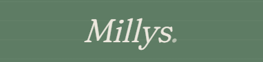
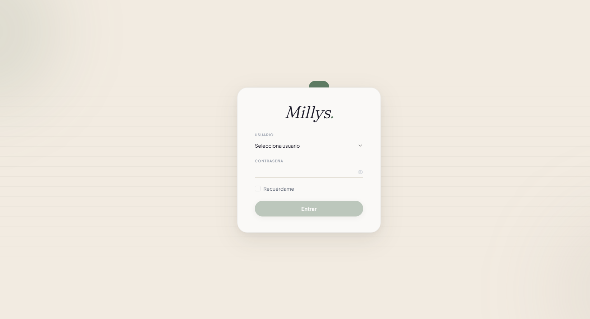
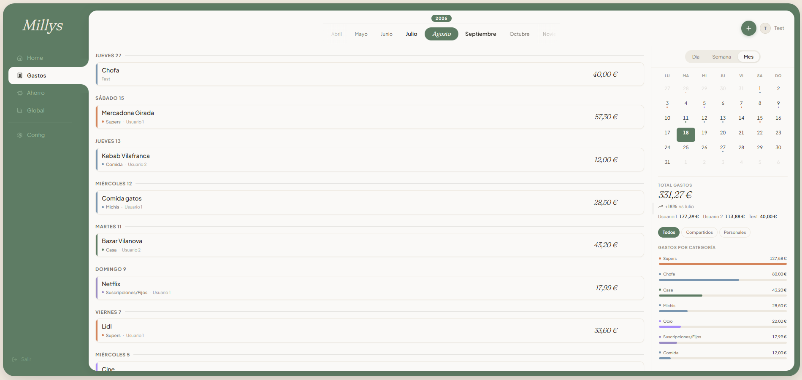
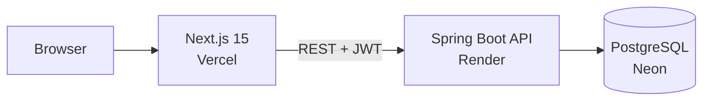
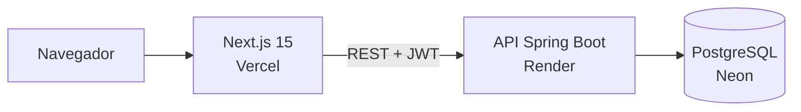

# Millys

**A monthly expense tracker for couples, built to replace a shared spreadsheet.**
 
Un gestor de gastos mensuales para parejas, hecho para sustituir una hoja de cálculo compartida.

 

[Live · millys.es](https://millys.es) &nbsp;·&nbsp; [English](#english) &nbsp;·&nbsp; [Español](#español)

 

<table>
  <tr>
    <td width="50%"></td>
    <td width="50%"></td>
  </tr>
</table>

---

## English

Personal project to practice Spring Boot and a modern full-stack setup.

### Try it

| | |
|---|---|
| **Site** | https://millys.es |
| **User** | `Test` |
| **Password** | `TestMillys!` |

> [!NOTE]
> The backend runs on a free tier, so the first request can take up to a
> minute while it starts up.

### About this project

I built most of this project with Claude Code, both to try the tool and to
learn: how Spring Boot, JWT security, Next.js and a serverless database fit
together in one app. It is not code I wrote entirely by myself.

I plan to build a separate CRUD project (Spring Boot + React) on my own to
practice writing the code by hand, and I'll link it here when it exists.

### Architecture

### Stack

| Layer | Technologies |
|---|---|
| Backend | Java 21, Spring Boot 3, Spring Security, JWT, Spring Data JPA |
| Frontend | Next.js 15 (App Router), TypeScript, Tailwind CSS, shadcn/ui, Recharts |
| Database | PostgreSQL on Neon |
| Deployment | Vercel (frontend), Render (backend) |

### Design

Japandi-inspired: a sage-green shell on sand backgrounds, charcoal text, and
Fraunces paired with Plus Jakarta Sans. Calm and personal rather than corporate.

### Status

Published at https://millys.es

| Feature | State |
|---|---|
| JWT authentication | Done |
| Login page and dashboard layout | Done |
| Monthly expense management (CRUD) | Done |
| Charts | Done |
| Custom domain (millys.es) | Done |

[Back to top](#millys)

---

## Español

Proyecto personal para practicar Spring Boot y un stack full stack actual.

### Pruébala

| | |
|---|---|
| **Web** | https://millys.es |
| **Usuario** | `Test` |
| **Contraseña** | `TestMillys!` |

> [!NOTE]
> El backend usa un plan gratuito, así que la primera petición puede tardar
> hasta un minuto en responder mientras arranca.

### Sobre este proyecto

Hice la mayor parte del proyecto con Claude Code, tanto para probar la
herramienta como para aprender cómo encajan Spring Boot, la seguridad con JWT,
Next.js y una base de datos serverless en una misma app. No es código escrito
íntegramente por mí.

Tengo previsto hacer aparte un proyecto CRUD (Spring Boot + React) por mi
cuenta para practicar escribiendo el código a mano, y lo enlazaré aquí cuando
exista.

### Arquitectura

### Stack

| Capa | Tecnologías |
|---|---|
| Backend | Java 21, Spring Boot 3, Spring Security, JWT, Spring Data JPA |
| Frontend | Next.js 15 (App Router), TypeScript, Tailwind CSS, shadcn/ui, Recharts |
| Base de datos | PostgreSQL en Neon |
| Despliegue | Vercel (frontend), Render (backend) |

### Diseño

Inspirado en el estilo Japandi: estructura verde salvia sobre fondos arena,
texto carbón, y Fraunces combinada con Plus Jakarta Sans. Tranquilo y personal
en lugar de corporativo.

### Estado

Publicado en https://millys.es

| Funcionalidad | Estado |
|---|---|
| Autenticación con JWT | Hecho |
| Página de login y layout del dashboard | Hecho |
| Gestión de gastos mensuales (CRUD) | Hecho |
| Gráficos | Hecho |
| Dominio propio (millys.es) | Hecho |

[Volver arriba](#millys)

